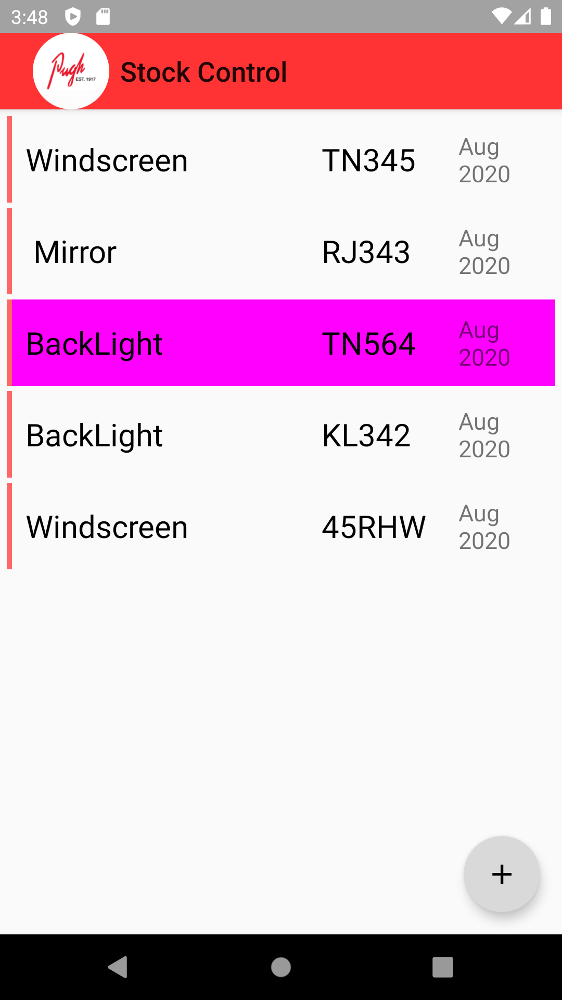
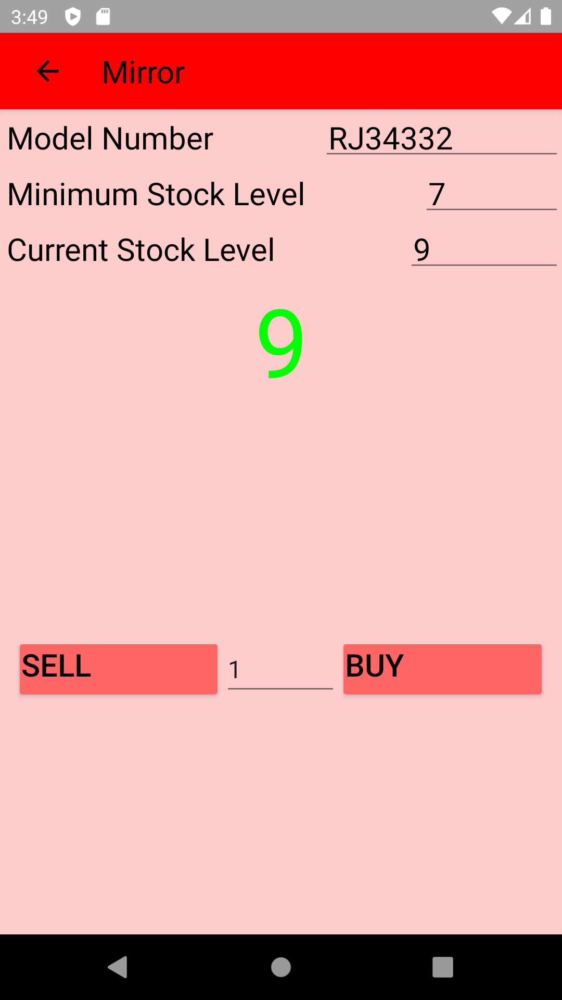
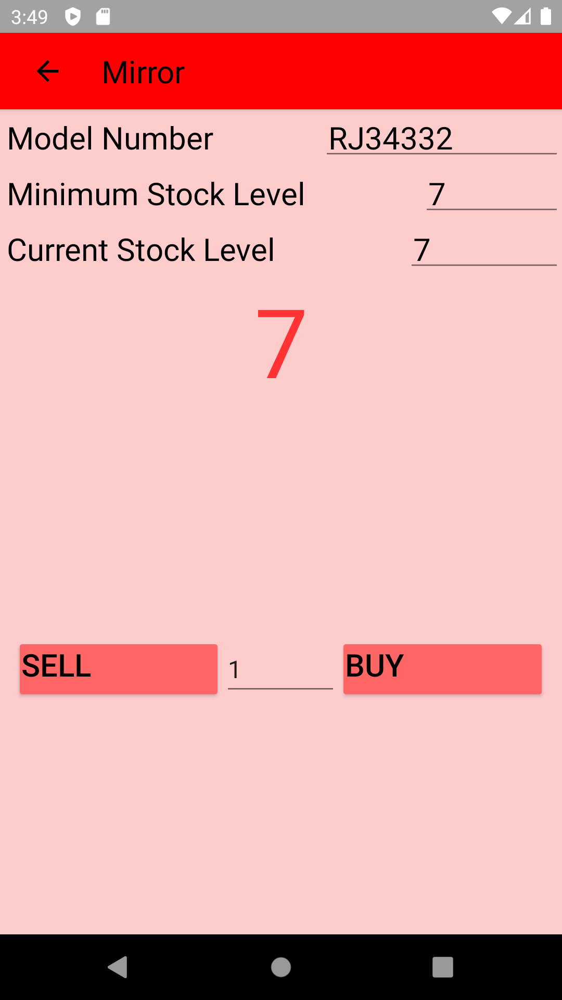
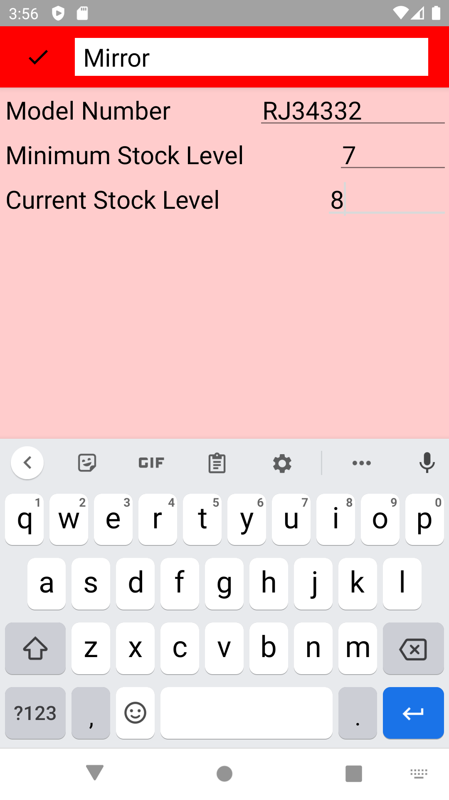

<li>Themes, color schemes, hex colors and styles</li>
<li>Building Custom Toolbars</li>
<li>Customizing Toolbar Behaviors with CoordinatorLayout and AppBarLayout</li>
<li>Implementing a RecyclerView</li>
<li>RecyclerView OnClickListeners</li>
<li>Navigating to a new activity with RecyclerView Click</li>
<li>Navigating to different activities using intents</li>
<li>Passing data between activities using a bundle</li>
<li>Passing data between activities using intent extras</li>
<li>Threading and AsyncTask basics</li>
<li>Custom layouts oriented around custom data models</li>
<li>Building custom data models</li>
<li>Using proper architecture patterns with Room</li>
<li>Read, Write, Update and Delete SQLite database transactions</li>
<li>And much more...</li>
</ul>
 
